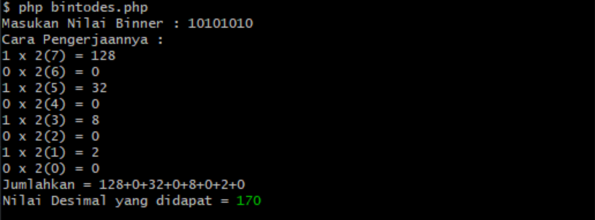

## cli-binary-to-decimal
Convert binary to decimal with step

## Usage

```
$ git clone https://github.com/mohalhilal/cli-binary-to-decimal.git
$ cd cli-binary-to-decimal
$ ls
$ php bintodes.php
```




## Credit 
- Me 😀

